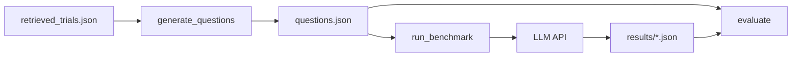

# TrialGPT Benchmark: End-to-End Data Flow

This document explains **how data moves through the current codebase**, from raw files to the moment an LLM is called, and then through scoring. It is written for readers who are new to the project.

**Scope:** The repository as it exists today is built around a **clinical trial recruitment benchmark**: synthetic “questions” are built from patient–trial data, sent to a language model, and evaluated against hidden gold labels. Older TrialGPT modules (retrieval, hybrid fusion, ranking aggregation, etc.) are **not** present in the current tree; this doc reflects only what the **`benchmark/`** package does.

---

## 1. Big picture: three phases

| Phase | What runs | Main inputs | Main outputs |
|--------|-----------|-------------|--------------|
| **A. Build questions** | `python -m benchmark.generate_questions` | `dataset/<name>/retrieved_trials.json` + `dataset/<name>/qrels/test.tsv` (qrels not used inside prompts; see §2.2) | `benchmark/data/questions.json` |
| **B. Call the LLM** | `python -m benchmark.run_benchmark` | `questions.json` + API keys | `benchmark/results/<model>.json` |
| **C. Score models** | `python -m benchmark.evaluate` | `questions.json` + all `results/*.json` | Console report; optional `benchmark/reports/evaluation_report.json` |

Conceptually:



---

## 2. Starting data: what sits on disk before anything runs

### 2.1 `dataset/<dataset>/retrieved_trials.json`

This is a **JSON array**. Each element describes **one patient** and the **clinical trials** that were retrieved for that patient, already **grouped by relevance label**.

**Per-patient object (conceptual schema):**

| Field | Meaning |
|--------|---------|
| `patient_id` | Stable ID for the patient (e.g. TREC query id). |
| `patient` | A single **free-text clinical note** (the “patient record”). |
| `"0"`, `"1"`, `"2"` | Lists of trial objects. Each list is trials at that **gold relevance / eligibility tier** for this patient. |

**Meaning of labels** (used for sampling and for evaluation, **not** shown to the model in the user prompt):

| Integer | Text label (in generated questions) |
|---------|-------------------------------------|
| 0 | `not_eligible` |
| 1 | `partially_eligible` |
| 2 | `eligible` |

**Per-trial object (fields the code actually uses):**

| Field | Used for |
|--------|-----------|
| `NCTID` | Trial identifier; appears in question ids and in ranking maps. |
| `brief_title` | Shown in prompts. |
| `phase` | Shown in prompts (or “Not specified”). |
| `diseases_list` | Joined into comma-separated “Target Conditions” / “Conditions”. |
| `drugs_list` | Joined into “Interventions”. |
| `brief_summary` | Full text in all question types (no truncation). |
| `inclusion_criteria` | Full text or split into numbered criteria (no truncation). |
| `exclusion_criteria` | Same as inclusion. |

Other fields in the JSON (e.g. `drugs`, `diseases`, `enrollment` as strings) may exist for lineage from upstream pipelines but **are not interpolated into the LLM prompts** by this benchmark code.

### 2.2 `dataset/<dataset>/qrels/test.tsv` (loaded for logging, not for prompt text)

`generate_questions.load_data()` **reads** this file whenever you run question generation. It must exist on disk for that corpus. The loader builds a `qrels` dictionary: for each query id, a map from trial id (NCT) → integer score.

**TSV shape:** Header row (skipped), then tab-separated rows: `query-id`, `corpus-id` (NCT id), `score`. **Robust parsing:** blank lines, lines starting with `#`, rows with fewer than three fields, and rows whose score is not a valid integer are **skipped** (no crash).

**Important:** In the current generator, **`qrels` is not used to build prompts or to pick trials**. It is only loaded so the script can **print** how many qrel judgments exist. All trial–label structure for questions comes from **`retrieved_trials.json`** keys `"0"`, `"1"`, `"2"`.

### 2.3 Dataset directories — what each folder holds

Corpora live under **`dataset/<corpus_name>/`**. The **`--dataset`** argument to `generate_questions` must match that folder name (for example `trec_2021`, `trec_2022`, `sigir`).

| Dataset folder | Typical research source | What the benchmark expects inside |
|----------------|-------------------------|----------------------------------|
| **`dataset/trec_2021/`** | TREC Clinical Trials Track 2021 | **`retrieved_trials.json`** — patients and trials grouped by relevance tier (§2.1). **`qrels/test.tsv`** — official topic–document relevance judgments (§2.2). |
| **`dataset/trec_2022/`** | TREC Clinical Trials Track 2022 | Same **expected** layout: `retrieved_trials.json` + `qrels/test.tsv`. Your tree may contain only part of that (for example qrels only) until you add the missing file from the upstream TrialGPT / TREC release. |
| **`dataset/sigir/`** | SIGIR patient–trial matching collection | Same **expected** layout: `retrieved_trials.json` + `qrels/test.tsv`. |

**Per-file summary:**

| File | What it contains | Used for prompts? |
|------|-------------------|-------------------|
| `retrieved_trials.json` | List of patients; each has a clinical **note** and trial objects under **`"0"` / `"1"` / `"2"`** | **Yes** — this drives all question text and gold labels in `questions.json`. |
| `qrels/test.tsv` | One row per (query id, NCT id, relevance score) judgment | **No** for prompt content — only loaded for the printed judgment count. |

**Minimum to run** `python -m benchmark.generate_questions --dataset <name>`: both **`dataset/<name>/retrieved_trials.json`** and **`dataset/<name>/qrels/test.tsv`** must exist.

### 2.4 Python files — what each module does

All runnable code for this benchmark lives under **`benchmark/`**.

| File | Responsibility |
|------|----------------|
| **`benchmark/__init__.py`** | Marks the directory as a package; docstring lists the three CLI steps (generate questions, run benchmark, evaluate). |
| **`benchmark/generate_questions.py`** | **`load_data()`** reads `retrieved_trials.json` and `qrels/test.tsv`. Helpers **`format_trial`**, **`parse_criteria_list`**, and **`generate_*_questions`** build the four task types. **No text is truncated** in any question type. **CLI:** writes **`benchmark/data/questions.json`**. |
| **`benchmark/run_benchmark.py`** | Creates the API client (OpenAI, Azure OpenAI, Anthropic, or **Google Gemini**). Sends questions **in parallel** via `ThreadPoolExecutor` (default **40 workers**, configurable with `--workers`). Each thread sends fixed **system** text + the question's full **`prompt`**. **`parse_response()`** strips markdown fences and parses JSON. **CLI:** writes to **`benchmark/results/<model>.json`** with optional resume. |
| **`benchmark/evaluate.py`** | Loads gold from **`questions.json`** and predictions from **`benchmark/results/*.json`**. Functions **`score_eligibility`**, **`score_ranking`**, **`score_criterion`**, **`score_missing_info`**, **`overall_score`** implement metrics. **CLI:** prints a model comparison table; **`--save-report`** writes **`benchmark/reports/evaluation_report.json`**. |

**Artifacts produced by the pipeline (not `.py` files):**

| Path | Created by |
|------|------------|
| `benchmark/data/questions.json` | `generate_questions` |
| `benchmark/results/<model_safe_name>.json` | `run_benchmark` |
| `benchmark/reports/evaluation_report.json` | `evaluate --save-report` |

---

## 3. Phase A — Question generation (data transformation in detail)

**Script:** `benchmark/generate_questions.py`  
**Output:** `benchmark/data/questions.json` with top-level:

- `metadata`: dataset name, random seed, counts per question type.
- `questions`: list of question objects, each with a pre-built **`prompt`** string (this is what will later be sent to the model as the **user** message).

### 3.1 Shared helper: turning a trial dict into prose — `format_trial(trial)`

This function **does not call an LLM**. It only **formats** fields into a fixed template:

1. **Title** ← `brief_title`
2. **Phase** ← `phase` or the string `Not specified`
3. **Target Conditions** ← `", ".join(diseases_list)` (empty list → empty string)
4. **Interventions** ← `", ".join(drugs_list)`
5. **Summary** ← full `brief_summary`
6. **Inclusion Criteria** ← raw `inclusion_criteria` or `N/A`
7. **Exclusion Criteria** ← raw `exclusion_criteria` or `N/A`

So the **transformation** here is: **structured trial JSON → one multi-section text block** for eligibility-style tasks.

### 3.2 Shared helper: splitting criteria — `parse_criteria_list(criteria_text)`

Used for **criterion_analysis** (and for counting criteria in metadata).

**Logic:**

1. Split the text on **double newlines** (`\n\n`) into paragraphs.
2. Skip very short paragraphs (`< 5` characters).
3. Skip paragraphs whose text contains the phrases `inclusion criteria` or `exclusion criteria` (to drop boilerplate headers).

**Effect:** Inclusion/exclusion blobs become a **list of strings**, each treated as one “criterion” for numbering and per-criterion assessment. This is a **heuristic**; real protocols are messier than perfect bullet lists.

### 3.3 Question type 1 — `eligibility`

**Goal:** One patient note + one trial → model outputs JSON with `reasoning` and `decision` (`eligible` | `partially_eligible` | `not_eligible`).

**Sampling:**

- For each patient, for each label `L` in `{0, 1, 2}`:
  - Take trials in `patient[str(L)]`.
  - Sample up to `max(1, per_patient // 3)` trials per label (default `per_patient` is 12 → up to 4 per label).
  - Uses `random.seed(seed)` for reproducibility.

**Prompt construction:**

- Fixed **instruction** paragraph (role + task).
- **`PATIENT RECORD:`** + full `patient` string.
- **`CLINICAL TRIAL:`** + `format_trial(trial)` (full summary + full inclusion/exclusion text).
- Fixed **classification rules** and **JSON schema** instructions.

**Stored on the question object (for evaluation, not sent to LLM in the prompt):**

- `gold_label` (0/1/2), `gold_label_text`
- `metadata`: counts of parsed inclusion/exclusion “criterion” chunks, patient note length

**What the LLM does *not* see:** The numeric or text gold label, `patient_id` / `trial_id` except as embedded in narrative if you added them (the generator does **not** put gold labels in the prompt).

### 3.4 Question type 2 — `ranking`

**Goal:** One patient + several trials labeled **A, B, C, …** → model outputs an ordered list of letters in JSON.

**Sampling:**

- Requires at least **3** trials total across labels for that patient.
- Tries to build a set with **diversity**: for each available label, take up to **2** trials, then trim or pad to `n_trials` (default 5) using remaining trials.
- Trial order in the prompt is **shuffled** after selection so letter assignment is not biased by label order.

**Trial text in ranking prompts (no truncation):**

For each selected trial, the prompt includes **full, untruncated** text:

- Title, Conditions, Interventions, Phase
- **Summary** — complete `brief_summary`
- **Inclusion Criteria** — complete `inclusion_criteria`
- **Exclusion Criteria** — complete `exclusion_criteria`

All question types now send the **full trial text** to the LLM; nothing is truncated.

**Letter map:**

- `trial_map`: e.g. `{"A": "NCT01234567", ...}` — used at **evaluation** time to turn the model’s letters back into NCT IDs and compare to `gold_scores`.

**Gold for metrics:**

- `gold_scores`: NCTID → 0/1/2
- `gold_ranking`: letters sorted by descending gold score (best first)

**What the LLM does *not* see:** `gold_scores`, `gold_ranking`, or NCT IDs in the ranking instructions (only letters **A–E** etc. and trial blurbs).

### 3.5 Question type 3 — `criterion_analysis`

**Goal:** Enumerate each inclusion/exclusion item as a numbered line; model returns per-index `status`, `reasoning`, `evidence`.

**Sampling:**

- Builds a candidate list of `(trial, label)` for each trial under labels **1, 2, 0** in that **preference order** (partially eligible first, then eligible, then not eligible) — so “interesting” trials are preferred when sampling.
- Takes up to `per_patient` trials per patient (default 3).

**Transformations:**

1. `parse_criteria_list` on inclusion and exclusion separately.
2. Number them in one list: inclusions first, then exclusions, each line prefixed with `[INCLUSION]` or `[EXCLUSION]`.
3. Parallel `criteria_list` in the JSON stores structured `{index, type, text}` for analysis tooling (not pasted wholesale into the prompt beyond the numbered block).

**Prompt includes:** patient note, trial title, conditions, then the **numbered criteria block** and status definitions (`met`, `not_met`, `insufficient_info`, `not_applicable`).

**What the LLM does *not* see:** `gold_eligibility` integer stored on the question.

### 3.6 Question type 4 — `missing_info`

**Goal:** Pre-screening chart review — what is **missing** from the chart to decide eligibility?

**Sampling:**

- Prefer trials from label `"1"` (partially eligible); if none, use `"2"`.
- Up to `per_patient` trials per patient (default 2).

**Prompt:** Same full trial text as eligibility (`format_trial`) plus patient note, plus JSON schema for `missing_items`, `overall_completeness`, `recommendation`.

**Note:** `gold_eligibility` is hard-coded to **1** in the generator for metadata consistency; the evaluator’s missing-info metrics **do not** compare to that gold — they measure structure and coverage of the model output.

### 3.7 Output file shape — `questions.json`

Each question has at least: `id`, `type`, `prompt`, plus type-specific fields (`gold_label`, `trial_map`, `criteria`, …).

**The `prompt` field is the complete user-facing task text** for that question. Nothing else from the question object is concatenated at runtime unless you change the runner.

---

## 4. Phase B — Running the benchmark (exactly what the LLM receives)

**Script:** `benchmark/run_benchmark.py`

### 4.1 Loading

1. Read `questions.json`.
2. Take `data["questions"]`.
3. Optionally **resume**: if the output file exists, load previous `predictions` and skip any `question_id` already present.

### 4.2 For each question: API call

The code sends **two** pieces of text to the provider (OpenAI, Azure OpenAI, Anthropic, or Google Gemini):

#### System message (constant for every question)

```text
You are a clinical trial recruitment specialist. Always respond with valid JSON exactly as instructed.
```

(This is defined as `SYSTEM_MSG` in `run_benchmark.py`.)

#### User message

The **entire** string `q["prompt"]` from `questions.json` — i.e. everything built in Phase A (instructions + patient + trial(s) + response format). **No** gold labels, **no** `trial_map` unless it was written inside `prompt` (it is not for ranking; only letters and trial blurbs appear).

### 4.3 Parallel execution

Questions are dispatched to a **`ThreadPoolExecutor`** with a default of **40 workers** (configurable via `--workers`). Each worker thread independently calls the provider API, so up to 40 questions are in-flight concurrently. A thread-safe lock protects the shared predictions list and periodic checkpoint saves (every 50 completions by default, configurable via `--save-every`).

### 4.4 Model parameters (same for all providers where applicable)

- **Temperature:** `0` (deterministic sampling).
- **Max tokens:** `5000`.
- **Retries:** up to 3 attempts with exponential backoff; on total failure the “raw response” is a JSON string `{"error": "..."}`.

### 4.5 Saving predictions

Each prediction record stores:

- `question_id`, `question_type`, `model`
- `raw_response` (exact string returned by the API)
- `parsed_response` (Python object after JSON parsing, or error wrapper)
- `parse_success`, `timestamp`

Output file shape:

```json
{
  "metadata": { "model", "provider", "n_predictions", "n_parse_failures", "last_updated" },
  "predictions": [ ... ]
}
```

---

## 5. Response parsing (LLM output → structured data)

**Function:** `parse_response(raw)` in `run_benchmark.py`

**Steps:**

1. Strip whitespace.
2. If the model wrapped JSON in markdown fences, remove leading ``` and optional `json` language tag and trailing ```.
3. `json.loads` the remainder.

**If parsing fails:** `parsed_response` becomes `{"raw_response": ..., "parse_error": True}` and `parse_success` is false. Downstream metrics **skip** or **under-count** failed parses depending on the metric.

---

## 6. Phase C — Evaluation (how predictions are compared to gold)

**Script:** `benchmark/evaluate.py`

Loads:

- All questions keyed by `id` from `questions.json`.
- For each `benchmark/results/*.json`, predictions keyed by `question_id`.

**Nothing in this phase is sent to an LLM.** It is pure offline scoring.

### 6.1 Eligibility (`type == "eligibility"`)

- Reads `parsed_response["decision"]`, maps text to 0/1/2 via `LABEL_TEXT_TO_INT`.
- Compares to `question["gold_label"]`.
- Reports accuracy, label-weighted accuracy, binary “eligible vs not” accuracy, confusion-style counts.

### 6.2 Ranking (`type == "ranking"`)

- Reads `parsed_response["ranking"]` as a list of letters.
- Maps each letter to NCTID via `question["trial_map"]`.
- Builds a sequence of **gold relevance scores** in model order; computes **NDCG@k** (k = min(5, length)) and **pairwise concordance** with gold ordering.

### 6.3 Criterion analysis (`type == "criterion_analysis"`)

- Compares count of `criteria` on the question to count of keys in `parsed_response["assessments"]` → **coverage**.
- Within each assessment, checks for non-empty `reasoning` and substantive `evidence` → **reasoning rate**, **evidence rate**.

### 6.4 Missing info (`type == "missing_info"`)

- Counts `missing_items`, presence of `recommendation`, `overall_completeness`, distribution of `importance` tags — **descriptive** metrics, not gold-label accuracy.

### 6.5 Overall score

Weighted blend of component scores (eligibility 40%, ranking 25%, criterion coverage 20%, missing-info recommendation rate 15% — components with zero evaluated questions are dropped from the denominator).

---

## 7. Quick reference: “What does the model see?”

| Data | Sent to LLM? | Where |
|------|----------------|--------|
| System instruction to output JSON | Yes | `SYSTEM_MSG` in `run_benchmark.py` |
| Patient note | Yes | Inside each `prompt` |
| Trial title, phase, conditions, drugs, summary | Yes | Inside `prompt` (full text, no truncation, all task types) |
| Inclusion / exclusion text | Yes | Full text for all question types (no truncation) |
| Numbered criteria list | Yes | Criterion-analysis prompts only |
| Gold label (0/1/2) | **No** | Only in `questions.json` for scoring |
| `trial_map` (letter → NCTID) | **No** | Evaluation only; prompt uses letters + blurbs |
| `gold_scores` / `gold_ranking` | **No** | Evaluation only |
| `criteria` structured list | **No** (as JSON); criterion text is duplicated in the prompt body | Evaluation / analysis |

---

## 8. Commands cheat sheet

```bash
# Regenerate question bank (default dataset trec_2021, output benchmark/data/questions.json)
python -m benchmark.generate_questions

# Run model -- set API env vars first (see provider table below)
# OpenAI / Azure OpenAI
python -m benchmark.run_benchmark --model gpt-4o --provider azure_openai

# Anthropic (Claude)
python -m benchmark.run_benchmark --model claude-3-5-sonnet-20241022 --provider anthropic

# Google Gemini
python -m benchmark.run_benchmark --model gemini-2.5-pro-preview-05-06 --provider gemini

# Override worker count (default 40)
python -m benchmark.run_benchmark --model gpt-4o --provider openai --workers 20

# Compare all result files
python -m benchmark.evaluate --save-report
```

**Environment variables by provider:**

| Provider | Required env var(s) |
|----------|---------------------|
| `azure_openai` | `OPENAI_ENDPOINT`, `OPENAI_API_KEY` |
| `openai` | `OPENAI_API_KEY` |
| `anthropic` | `ANTHROPIC_API_KEY` |
| `gemini` | `GEMINI_API_KEY` |

---

## 9. Relationship to “TrialGPT” as a research idea

Historically, **TrialGPT** referred to a larger system (retrieval, matching, ranking). **This repository snapshot** implements a **benchmark harness**: it assumes **retrieval and labeling are already done** and encoded in `retrieved_trials.json`. Understanding **how** that file was produced would require documentation or code **outside** the current `benchmark/` pipeline (or restored legacy modules).

---

*Generated to match the code in `benchmark/` as of the documentation update.*
